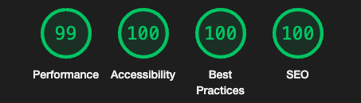

# Suite Landing Page

## 🚀 Features

- Optimal layout depending on their device's screen size.
- See hover states for interactive elements.

## 🛠️ Technologies Used

- **Vue JS**: Progressive JavaScript framework for building modern web applications.
- **TypeScript**: For type-safe development.

## 🌐 Live Demo

- <a href="https://jolly-frangollo-72d71b.netlify.app/" target="_blank">Live Demo</a>

## 🌟 Lighthouse Score

  

## 🌄 Preview

  

## Author

- LinkedIn - [Gümrah Sindar](https://www.linkedin.com/in/gumrahsindar/)
